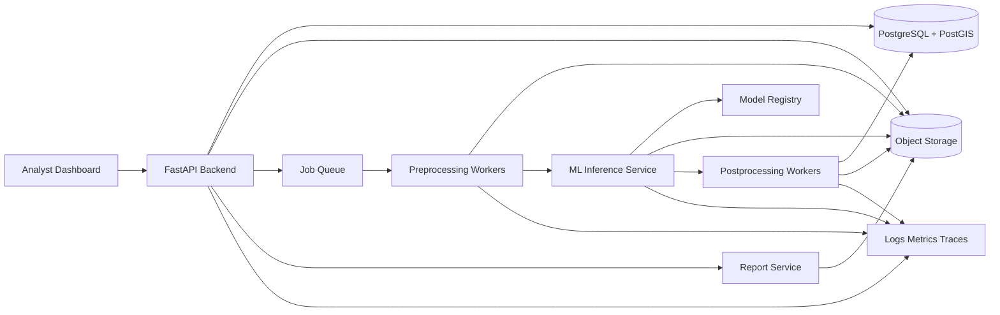

# System Architecture

## Architecture Overview

Sentinel AI should be built as a modular, cloud-ready platform with separate concerns for the frontend, API, asynchronous workers, ML inference, storage, and observability. The API should stay responsive while long-running geospatial and ML workloads run in background workers.

## Core Components

### Frontend Dashboard

Recommended stack: React, TypeScript, Vite or Next.js, MapLibre GL, deck.gl, and Tailwind CSS.

Responsibilities:

- Upload imagery or register cloud object URLs.
- Create disaster assessment projects.
- Monitor job progress.
- Render damage masks, polygons, and confidence overlays.
- Export reports and historical assessment data.

Trade-off: Next.js gives routing and server-side features, but Vite is simpler for a dashboard MVP. Choose Next.js if authentication, server-rendered pages, or hosted frontend conventions matter early.

### Backend API

Recommended stack: FastAPI, Pydantic, SQLAlchemy, Alembic, PostgreSQL, PostGIS, and Redis.

Responsibilities:

- Authentication and authorization.
- Project, image, assessment, job, and report APIs.
- Signed upload/download URL generation.
- Job orchestration and status tracking.
- Audit logging.

API contracts should be OpenAPI-first through FastAPI's generated schema, with stable request and response models committed to the repo.

### Background Processing

Recommended stack: Celery with Redis or RabbitMQ for MVP; managed queues such as AWS SQS, Google Pub/Sub, or Azure Service Bus for cloud production.

Job stages:

- `queued`
- `preprocessing`
- `inferencing`
- `postprocessing`
- `completed`
- `failed`

Workers should be idempotent where possible. Each stage should write durable artifacts and update job status transactionally.

### Data Ingestion

Supported MVP inputs:

- GeoTIFF upload.
- Cloud object registration through S3, GCS, or Azure Blob URL.
- Metadata fields for event name, disaster type, capture date, sensor, resolution, and area of interest.

Future inputs:

- STAC catalogs.
- Sentinel Hub, NASA, USGS, Maxar, or Planet integrations.
- Automated post-disaster imagery polling.

### Image Preprocessing

Pipeline:

- Validate file type, projection, bounds, channels, and resolution.
- Reproject when required.
- Tile large imagery into model-sized windows.
- Normalize channels using training-time statistics.
- Generate tile manifests and geospatial transforms.
- Run quality checks for cloud cover, missing bands, corrupt tiles, and low-information regions.

Trade-off: keeping preprocessing outside the API increases operational complexity but prevents large image jobs from blocking request handling.

### ML Inference Service

Recommended stack: PyTorch, TorchServe or a custom FastAPI inference service, ONNX Runtime for optimized CPU/GPU serving when appropriate.

Responsibilities:

- Load approved model versions.
- Run batch tile inference.
- Emit masks, object detections, class probabilities, and confidence scores.
- Store raw predictions and derived geospatial artifacts.
- Log model version, input version, preprocessing config, and runtime metrics.

Trade-off: a custom FastAPI inference service is easier to debug early; TorchServe, Triton, or managed endpoints are better when throughput, autoscaling, and model lifecycle management become harder.

### Database Layer

Recommended primary database: PostgreSQL with PostGIS.

Key tables:

- `users`: identity and role metadata.
- `organizations`: tenant boundary.
- `projects`: disaster events and areas of interest.
- `imagery_assets`: source imagery metadata and object storage references.
- `assessment_jobs`: job state, stage timestamps, failures, model version, and config hash.
- `prediction_layers`: vector or raster layer metadata, confidence thresholds, and storage references.
- `reports`: exported report metadata.
- `audit_events`: security and operational audit log.

PostGIS should store project boundaries, tile extents, prediction polygons, and spatial indexes.

### Storage Layer

Recommended storage: S3-compatible object storage.

Stored artifacts:

- Raw imagery.
- Preprocessed tiles.
- Tile manifests.
- Prediction masks.
- Vectorized GeoJSON or GeoParquet outputs.
- Reports.
- Model artifacts and evaluation bundles when not handled by a dedicated registry.

Lifecycle policies should move older intermediate tiles to cheaper storage or delete them after retention windows.

### Monitoring and Observability

Use structured logs, metrics, traces, and model monitoring.

Recommended tools:

- OpenTelemetry for traces.
- Prometheus and Grafana for metrics.
- Loki, ELK, or cloud logging for logs.
- Sentry for application errors.
- MLflow or Weights & Biases for experiments.
- Evidently, custom drift jobs, or batch reports for model monitoring.

Critical signals:

- API latency and error rate.
- Queue depth and job duration by stage.
- Worker failures and retry counts.
- GPU utilization and inference latency.
- Prediction confidence distribution.
- Data quality metrics such as cloud cover and missing bands.
- Calibration drift and analyst override rate.

## Security

- Use OAuth2/OIDC provider integration for production authentication.
- Use role-based access control for analyst, admin, and viewer roles.
- Store secrets in a managed secret manager, never in repo files.
- Use signed URLs for direct object storage access.
- Encrypt data in transit and at rest.
- Log security-sensitive actions to `audit_events`.
- Validate uploaded files before processing.
- Apply tenant scoping to every project, asset, job, and report query.

## Scalability

- Scale API replicas independently from worker replicas.
- Use queue-based backpressure for spikes after major disasters.
- Split CPU preprocessing workers and GPU inference workers.
- Cache map tiles and summary endpoints.
- Store large artifacts in object storage, not the database.
- Partition or archive old job and audit records as usage grows.

## Cost Optimization

- Use spot or preemptible GPU workers for non-urgent batch jobs.
- Keep CPU preprocessing separate from GPU inference.
- Delete or tier intermediate tiles after retention windows.
- Use model quantization or ONNX Runtime for lower-cost inference when accuracy permits.
- Run scheduled data quality checks before expensive inference.

## Failure Handling

- Persist every job stage and artifact path before moving to the next stage.
- Use retry policies with dead-letter queues.
- Mark failures with actionable error codes.
- Make report generation retryable and independent from inference completion.
- Avoid deleting original imagery when downstream stages fail.
- Provide admin tools for retrying failed jobs and inspecting worker logs.

## CI/CD and Deployment

MVP deployment can use Docker Compose for local development and a managed container platform for production.

Recommended path:

- Local: Docker Compose for API, frontend, PostgreSQL/PostGIS, Redis, and worker containers.
- Staging: managed container service plus managed database and object storage.
- Production: Kubernetes or managed container apps once autoscaling, GPU scheduling, and environment isolation are needed.

CI should run:

- Python linting and type checks.
- Unit tests.
- API contract validation.
- Database migration checks.
- Frontend linting and tests.
- Docker image build.
- Basic model package smoke test.

## Testing Strategy

- Unit tests for preprocessing utilities, API services, and database models.
- Integration tests for upload, job creation, worker execution, and report generation.
- Contract tests for API request and response schemas.
- Golden-image tests for deterministic preprocessing.
- Model evaluation tests against a fixed validation set.
- Load tests for queue throughput and map endpoints.
- Security tests for authorization boundaries and signed URL behavior.

## Initial ADRs to Create

- ADR-001: Use FastAPI for backend services.
- ADR-002: Use PostgreSQL with PostGIS for geospatial persistence.
- ADR-003: Use object storage for raw imagery and ML artifacts.
- ADR-004: Use asynchronous workers for preprocessing and inference.
- ADR-005: Use MLflow or Weights & Biases for experiment tracking and model registry.
